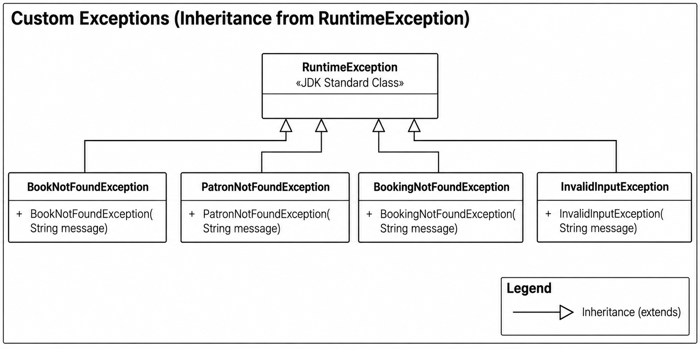
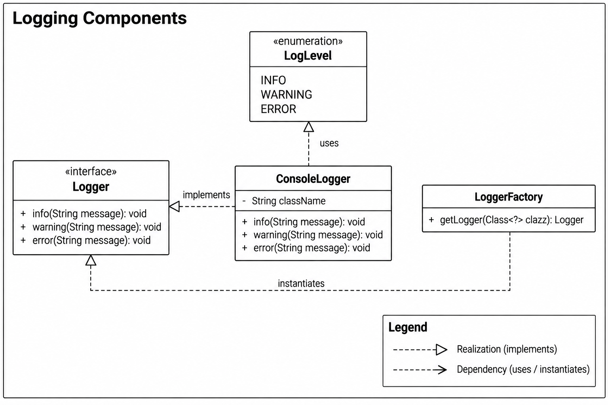
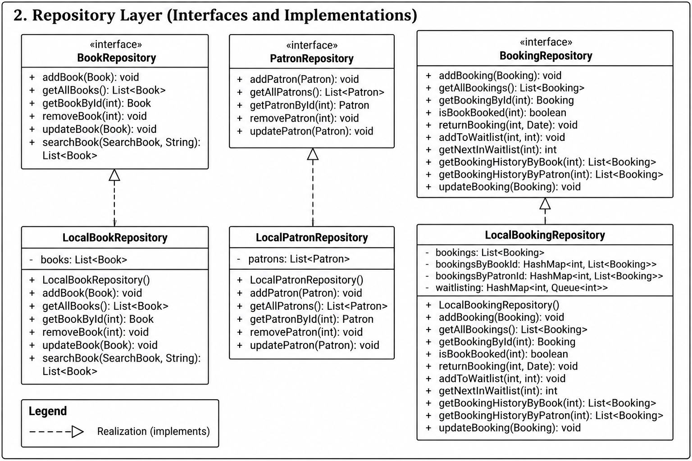
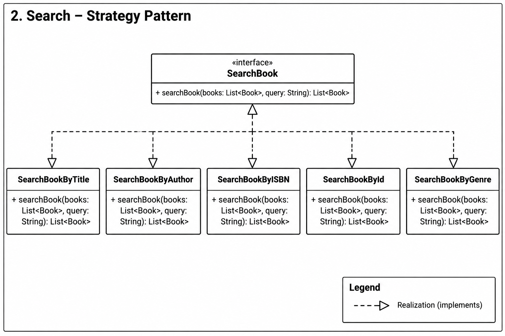
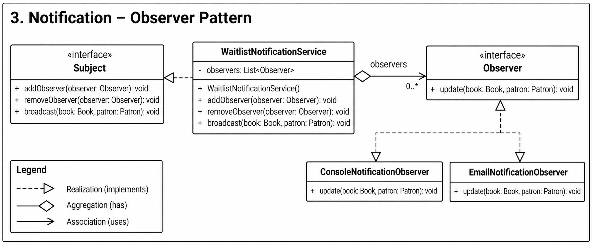
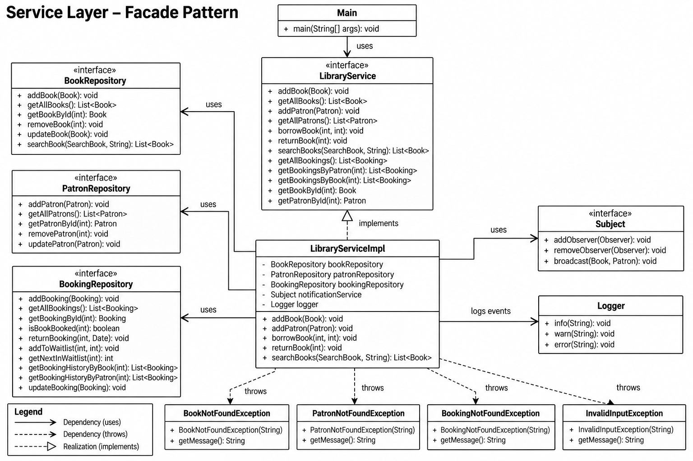

# Library Management System

A console-based Library Management System built in Java demonstrating core OOP principles and multiple design patterns.

---

## Features

- Add and view books
- Register and view patrons
- Borrow and return books
- Waitlist management with automatic notifications
- Search books by title, author, ISBN, ID, or genre
- Custom logging framework (console logger with timestamps and log levels)
- Custom exception handling in the service layer (`BookNotFoundException`, `PatronNotFoundException`, etc.)
- View all bookings, book booking history, and user booking history

---

## How to Run

```bash
javac -d bin $(find . -name "*.java")
java -cp bin com.airtribe.libraryManagementSystem.Main
```

---

## Project Structure

```
com.airtribe.libraryManagementSystem
├── Main.java
├── constants/
│   └── AppConstants.java
├── model/
│   ├── Book.java
│   ├── Patron.java
│   └── Booking.java
├── util/
│   └── IdGenerator.java
├── exception/
│   ├── BookNotFoundException.java
│   ├── PatronNotFoundException.java
│   ├── BookingNotFoundException.java
│   └── InvalidInputException.java
├── logging/
│   ├── LogLevel.java
│   ├── Logger.java
│   ├── ConsoleLogger.java
│   └── LoggerFactory.java
├── repository/
│   ├── BookRepository.java
│   ├── PatronRepository.java
│   ├── BookingRepository.java
│   ├── LocalBookRepository.java
│   ├── LocalPatronRepository.java
│   └── LocalBookingRepository.java
├── search/
│   ├── SearchBook.java
│   ├── SearchBookByTitle.java
│   ├── SearchBookByAuthor.java
│   ├── SearchBookByISBN.java
│   ├── SearchBookById.java
│   └── SearchBookByGenre.java
├── notification/
│   ├── Observer.java
│   ├── Subject.java
│   ├── WaitlistNotificationService.java
│   ├── ConsoleNotificationObserver.java
│   └── EmailNotificationObserver.java
└── services/
    ├── LibraryService.java
    └── LibraryServiceImpl.java
```

---

## Design Patterns

| Pattern        | Where Used                                                                     |
| -------------- | ------------------------------------------------------------------------------ |
| **Facade**     | `LibraryServiceImpl` — single entry point over all subsystems                  |
| **Observer**   | `WaitlistNotificationService` notifies patrons on book return                  |
| **Strategy**   | `SearchBook` interface with 5 interchangeable search strategies                |
| **Repository** | `BookRepository`, `PatronRepository`, `BookingRepository` abstract data access |
| **Factory**    | `LoggerFactory` creates class-specific `Logger` instances                      |

---

## SOLID Principles

### S — Single Responsibility Principle
> *Each class has one and only one reason to change.*

| Class                                    | Responsibility                                            |
| ---------------------------------------- | --------------------------------------------------------- |
| `Book`, `Patron`, `Booking`              | Hold domain data only                                     |
| `IdGenerator`                            | Auto-generate unique IDs                                  |
| `Book/Patron/BookingNotFoundException`   | Encapsulate domain-specific lookup failure errors         |
| `InvalidInputException`                  | Encapsulate validation failure errors                     |
| `ConsoleLogger`                          | Format and print logs to console                          |
| `LoggerFactory`                          | Instantiate loggers for classes                           |
| `LocalBookRepository`                    | Store and retrieve book data                              |
| `LocalPatronRepository`                  | Store and retrieve patron data                            |
| `LocalBookingRepository`                 | Store and retrieve booking data                           |
| `SearchBookByTitle/Author/ISBN/Id/Genre` | One search strategy each                                  |
| `ConsoleNotificationObserver`            | Log notification to console                               |
| `EmailNotificationObserver`              | Simulate sending an email notification                    |
| `WaitlistNotificationService`            | Manage observers and broadcast events                     |
| `LibraryServiceImpl`                     | Orchestrate domain rules and validation — throws exceptions|

---

### O — Open/Closed Principle
> *Open for extension, closed for modification.*

New behaviour is added by creating new classes, never by editing existing ones:

| Extension Scenario                   | How to Add                                          | Modify Existing Code? |
| ------------------------------------ | --------------------------------------------------- | --------------------- |
| New search type (e.g. by Genre)      | Create `SearchBookByGenre implements SearchBook`    | ❌ No                  |
| New notification channel (SMS, Push) | Create `SmsObserver implements Observer`            | ❌ No                  |
| New logger (e.g., File, Database)    | Create `FileLogger implements Logger`               | ❌ No                  |
| New domain exception                 | Create `NewException extends RuntimeException`      | ❌ No                  |
| Swap in-memory DB with real DB       | Create `DbBookRepository implements BookRepository` | ❌ No                  |

---

### L — Liskov Substitution Principle
> *A subtype must be fully substitutable for its base type.*

Every concrete class honours its interface or superclass contract cleanly:

```
ConsoleLogger              →  fully substitutes  Logger
BookNotFoundException      →  fully substitutes  RuntimeException
PatronNotFoundException    →  fully substitutes  RuntimeException
BookingNotFoundException   →  fully substitutes  RuntimeException
InvalidInputException      →  fully substitutes  RuntimeException
LocalBookRepository        →  fully substitutes  BookRepository
LocalPatronRepository      →  fully substitutes  PatronRepository
LocalBookingRepository     →  fully substitutes  BookingRepository
LibraryServiceImpl         →  fully substitutes  LibraryService
SearchBookByTitle          →  fully substitutes  SearchBook
ConsoleNotificationObserver → fully substitutes Observer
WaitlistNotificationService → fully substitutes Subject
```

---

### I — Interface Segregation Principle
> *Clients should not be forced to depend on methods they don't use.*

Each interface is kept focused to its own domain:

| Interface           | Purpose                         | Methods                    |
| ------------------- | ------------------------------- | -------------------------- |
| `Logger`            | Logging operations              | 3 — `info, warning, error` |
| `Observer`          | Receive notifications           | 1 — `update()`             |
| `Subject`           | Manage & broadcast to observers | 3 — `add/remove/broadcast` |
| `SearchBook`        | Define a search strategy        | 1 — `searchBook()`         |
| `BookRepository`    | Book data access only           | 6                          |
| `PatronRepository`  | Patron data access only         | 5                          |
| `BookingRepository` | Booking data access only        | 10                         |

---

### D — Dependency Inversion Principle
> *High-level modules depend on abstractions, not concretions.*

`LibraryServiceImpl`, `Main`, and observers depend only on interface abstractions:

```java
// Dependencies are abstractions ✅
private final BookRepository bookRepository;       // interface
private final PatronRepository patronRepository;   // interface
private final BookingRepository bookingRepository; // interface
private final Subject notificationService;         // interface
private static final Logger logger = LoggerFactory.getLogger(LibraryServiceImpl.class); // Logger interface
```

All concrete wiring is done in `Main` (the composition root):

```java
Subject notificationService = new WaitlistNotificationService();
notificationService.addObserver(new ConsoleNotificationObserver());
notificationService.addObserver(new EmailNotificationObserver());

LibraryService libraryService = new LibraryServiceImpl(
    new LocalBookRepository(),
    new LocalPatronRepository(),
    new LocalBookingRepository(),
    notificationService
);
```

---

## Class Diagrams

### 1. Model Layer (Domain)

.png)

---

### 2. Custom Exception Hierarchy



---

### 3. Custom Logging Framework (Factory Pattern)



---

### 4. Repository Layer



---

### 5. Search — Strategy Pattern



---

### 6. Notification — Observer Pattern



---

### 7. Service — Facade Pattern



---

## Menu Options

```
===== Library Management System =====
1.  Add Book
2.  View All Books
3.  Borrow Book
4.  Return Book
5.  Search Books
6.  Add Patron
7.  View All Patrons
8.  View All Bookings
9.  View Book History
10. View User History
0.  Exit
=====================================
```
