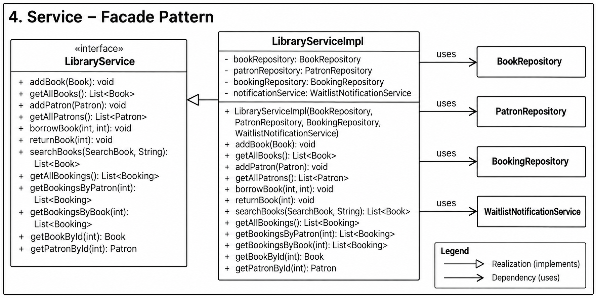

# Library Management System

A console-based Library Management System built in Java demonstrating core OOP principles and multiple design patterns.

---

## Features

- Add and view books
- Register and view patrons
- Borrow and return books
- Waitlist management with automatic notifications
- Search books by title, author, ISBN, ID, or genre
- View all bookings, book booking history, and user booking history

---

## How to Run

```bash
javac -d bin $(find . -name "*.java")
java -cp bin com.airtribe.libraryManagementSystem.Main
```

---

## Project Structure

```
com.airtribe.libraryManagementSystem
├── Main.java
├── constants/
│   └── AppConstants.java
├── model/
│   ├── Book.java
│   ├── Patron.java
│   └── Booking.java
├── util/
│   └── IdGenerator.java
├── repository/
│   ├── BookRepository.java
│   ├── PatronRepository.java
│   ├── BookingRepository.java
│   ├── LocalBookRepository.java
│   ├── LocalPatronRepository.java
│   └── LocalBookingRepository.java
├── search/
│   ├── SearchBook.java
│   ├── SearchBookByTitle.java
│   ├── SearchBookByAuthor.java
│   ├── SearchBookByISBN.java
│   ├── SearchBookById.java
│   └── SearchBookByGenre.java
├── notification/
│   ├── Observer.java
│   ├── Subject.java
│   ├── WaitlistNotificationService.java
│   ├── ConsoleNotificationObserver.java
│   └── EmailNotificationObserver.java
└── services/
    ├── LibraryService.java
    └── LibraryServiceImpl.java
```

---

## Design Patterns

| Pattern        | Where Used                                                                     |
| -------------- | ------------------------------------------------------------------------------ |
| **Facade**     | `LibraryServiceImpl` — single entry point over all subsystems                  |
| **Observer**   | `WaitlistNotificationService` notifies patrons on book return                  |
| **Strategy**   | `SearchBook` interface with 5 interchangeable search strategies                |
| **Repository** | `BookRepository`, `PatronRepository`, `BookingRepository` abstract data access |

---

## SOLID Principles

### S — Single Responsibility Principle
> *Each class has one and only one reason to change.*

| Class                                    | Responsibility                                            |
| ---------------------------------------- | --------------------------------------------------------- |
| `Book`, `Patron`, `Booking`              | Hold domain data only                                     |
| `IdGenerator`                            | Auto-generate unique IDs                                  |
| `LocalBookRepository`                    | Store and retrieve book data                              |
| `LocalPatronRepository`                  | Store and retrieve patron data                            |
| `LocalBookingRepository`                 | Store and retrieve booking data                           |
| `SearchBookByTitle/Author/ISBN/Id/Genre` | One search strategy each                                  |
| `ConsoleNotificationObserver`            | Print notification to console                             |
| `EmailNotificationObserver`              | Simulate sending an email                                 |
| `WaitlistNotificationService`            | Manage observers and broadcast                            |
| `LibraryServiceImpl`                     | Orchestrate (delegates — never implements logic directly) |

---

### O — Open/Closed Principle
> *Open for extension, closed for modification.*

New behaviour is added by creating new classes, never by editing existing ones:

| Extension Scenario                   | How to Add                                          | Modify Existing Code? |
| ------------------------------------ | --------------------------------------------------- | --------------------- |
| New search type (e.g. by Genre)      | Create `SearchBookByGenre implements SearchBook`    | ❌ No                  |
| New notification channel (SMS, Push) | Create `SmsObserver implements Observer`            | ❌ No                  |
| Swap in-memory DB with real DB       | Create `DbBookRepository implements BookRepository` | ❌ No                  |

---

### L — Liskov Substitution Principle
> *A subtype must be fully substitutable for its base type.*

Every concrete class honours its interface contract without narrowing behaviour:

```
LocalBookRepository    →  fully substitutes  BookRepository
LocalPatronRepository  →  fully substitutes  PatronRepository
LocalBookingRepository →  fully substitutes  BookingRepository
LibraryServiceImpl     →  fully substitutes  LibraryService
SearchBookByTitle      →  fully substitutes  SearchBook
ConsoleNotificationObserver → fully substitutes Observer
WaitlistNotificationService → fully substitutes Subject
```

---

### I — Interface Segregation Principle
> *Clients should not be forced to depend on methods they don't use.*

Each interface is kept focused to its own domain:

| Interface           | Purpose                         | Methods                    |
| ------------------- | ------------------------------- | -------------------------- |
| `Observer`          | Receive notifications           | 1 — `update()`             |
| `Subject`           | Manage & broadcast to observers | 3 — `add/remove/broadcast` |
| `SearchBook`        | Define a search strategy        | 1 — `searchBook()`         |
| `BookRepository`    | Book data access only           | 6                          |
| `PatronRepository`  | Patron data access only         | 5                          |
| `BookingRepository` | Booking data access only        | 10                         |

---

### D — Dependency Inversion Principle
> *High-level modules depend on abstractions, not concretions.*

`LibraryServiceImpl` depends only on interfaces — it never references any concrete class directly:

```java
// LibraryServiceImpl — all dependencies are abstractions ✅
private final BookRepository bookRepository;       // interface
private final PatronRepository patronRepository;   // interface
private final BookingRepository bookingRepository; // interface
private final Subject notificationService;         // interface

// Constructor receives Subject — not WaitlistNotificationService ✅
public LibraryServiceImpl(..., Subject notificationService) {
    this.notificationService = notificationService;
}
```

All concrete wiring is done in `Main` (the composition root):

```java
// Main.java — only place that knows about concrete classes ✅
Subject notificationService = new WaitlistNotificationService();
notificationService.addObserver(new ConsoleNotificationObserver());
notificationService.addObserver(new EmailNotificationObserver());

LibraryService libraryService = new LibraryServiceImpl(
    new LocalBookRepository(),
    new LocalPatronRepository(),
    new LocalBookingRepository(),
    notificationService
);
```

---

## Class Diagram

### 1. Model Layer (Domain)

.png)

---

### 2. Repository Layer


---

### 3. Search — Strategy Pattern


---

### 4. Notification — Observer Pattern


---

### 5. Service — Facade Pattern



---

## Menu Options

```
===== Library Management System =====
1.  Add Book
2.  View All Books
3.  Borrow Book
4.  Return Book
5.  Search Books
6.  Add Patron
7.  View All Patrons
8.  View All Bookings
9.  View Book History
10. View User History
0.  Exit
=====================================
```
